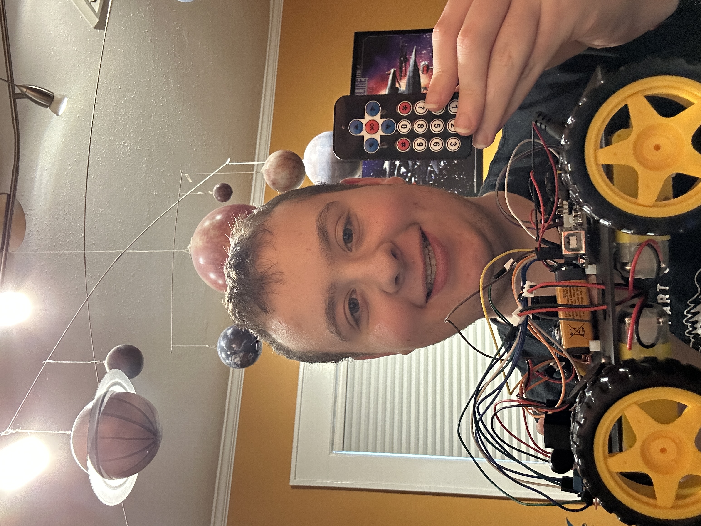

# Infrared Controlled robot, Kobayashi Maru
This project is a wireless, Arduino‑driven robotic car that uses an IR remote for control instead of gesture input. The onboard IR receiver decodes remote commands and translates them into motor actions for steering, throttle, and braking. A motor driver handles the power delivery to the wheels, while the Arduino manages timing, direction, and command processing.

This build focuses on embedded control, wireless communication, and real‑time motor driving. 


| **Engineer** | **School** | **Area of Interest** | **Grade** |
|:--:|:--:|:--:|:--:|
| Asher M | Yeshivat Frisch | Computer Science | Incoming Junior



  
# Final Milestone

<iframe width="560" height="315" src="https://www.youtube.com/embed/neqEeXhMXvA?si=XrfGbD13r2VVgNvG" title="YouTube video player" frameborder="0" allow="accelerometer; autoplay; clipboard-write; encrypted-media; gyroscope; picture-in-picture; web-share" referrerpolicy="strict-origin-when-cross-origin" allowfullscreen></iframe>

For your final milestone, explain the outcome of your project. Key details to include are:
- I've added IR control
- My biggest challenge was the remote control Bluetooth didnt work despite several creative solution but eventually I was able to get it working using IR
- I learned about remote control, Motor Driver, and reputable manufacturers
- I hope to learn more about the coding side of things in it was the most fun and very straight forwards on this project


# First Milestone

<iframe width="560" height="315" src="https://www.youtube.com/embed/jKzRvB4pZn8?si=eezAk86leaGEL-HH" title="YouTube video player" frameborder="0" allow="accelerometer; autoplay; clipboard-write; encrypted-media; gyroscope; picture-in-picture; web-share" referrerpolicy="strict-origin-when-cross-origin" allowfullscreen></iframe>

Components & How They Integrate
- **Arduino Uno** – main controller that sends direction and speed signals.
- **L298N Motor Driver** – receives signals from the Arduino and controls all four DC motors.
- **DC Motors (x4)** – provide movement; wired to OUT1–OUT4 on the driver.
- **9V battries** – powers everything.
- **Bluetooth Module (HC‑05)** – will receive gesture commands from the glove.

---

Technical Progress So Far
- Fully assembled and wired the robot chassis and mounted all motors.

---

Challenges
- Unclear Car schematics, I worked around it by discarding the instrcutions entirly and using logical deduction to to connect the parts of the chasis.
- HC05 pairing issues, I initally was able to work around it using one of my projects, [Subspace Relay](https://github.com/asherm613/Subspace-Relay) but the modules then died so I decided to switch to a much simpler transciver system, IR and remove gestyure controlls entirly

---

Future Plans
- Build the gesture‑control glove using the Nano, IMU, and RF24.
- Convert hand tilt into direction and speed values.
- Send those values over Bluetooth to the car.
- Integrate glove → car communication and refine responsiveness.


# Schematics 
.png)

# Code
```c++
#include <IRremote.h>

#define IR_PIN 2   // IR on pin 2

// FRONT MOTORS (BOW)
int FL_FWD = 3;     // front-left forward
int FL_REV = 4;     // front-left reverse

int FR_FWD = 13;    // front-right forward
int FR_REV = 10;    // front-right reverse

// REAR MOTORS (STERN)
int BL_FWD = 12;    // back-left forward
int BL_REV = 11;    // back-left reverse

int BR_FWD = 8;     // back-right forward
int BR_REV = 7;     // back-right reverse

void setup() {
  Serial.begin(9600);
  Serial.println(" ");
  Serial.println("initiate startup on USS Kobayashi Maru authorization 4-7 Alpha Tango");
 
  pinMode(FL_FWD, OUTPUT);
  pinMode(FL_REV, OUTPUT);
  pinMode(FR_FWD, OUTPUT);
  pinMode(FR_REV, OUTPUT);

  pinMode(BL_FWD, OUTPUT);
  pinMode(BL_REV, OUTPUT);
  pinMode(BR_FWD, OUTPUT);
  pinMode(BR_REV, OUTPUT);

  IrReceiver.begin(IR_PIN, ENABLE_LED_FEEDBACK);
}

void allStop() {
  Serial.println("all stop");

  digitalWrite(FL_FWD, LOW);
  digitalWrite(FL_REV, LOW);
  digitalWrite(FR_FWD, LOW);
  digitalWrite(FR_REV, LOW);
  digitalWrite(BL_FWD, LOW);
  digitalWrite(BL_REV, LOW);
  digitalWrite(BR_FWD, LOW);
  digitalWrite(BR_REV, LOW);
}

void forward() {
  Serial.println("engage");

  // FRONT LEFT
  digitalWrite(FL_FWD, HIGH);
  digitalWrite(FL_REV, LOW);

  // FRONT RIGHT
  digitalWrite(FR_FWD, HIGH);
  digitalWrite(FR_REV, LOW);

  // BACK LEFT
  digitalWrite(BL_FWD, HIGH);
  digitalWrite(BL_REV, LOW);

  // BACK RIGHT
  digitalWrite(BR_FWD, HIGH);
  digitalWrite(BR_REV, LOW);
}

void backward() {
  Serial.println("reverse engines");

  // FRONT LEFT
  digitalWrite(FL_FWD, LOW);
  digitalWrite(FL_REV, HIGH);

  // FRONT RIGHT
  digitalWrite(FR_FWD, LOW);
  digitalWrite(FR_REV, HIGH);

  // BACK LEFT
  digitalWrite(BL_FWD, LOW);
  digitalWrite(BL_REV, HIGH);

  // BACK RIGHT
  digitalWrite(BR_FWD, LOW);
  digitalWrite(BR_REV, HIGH);
}

void left() {
  Serial.println("heading 090");

  digitalWrite(FL_FWD, LOW);
  digitalWrite(FL_REV, LOW);

  digitalWrite(BL_FWD, LOW);
  digitalWrite(BL_REV, LOW);

  // right side backward
  digitalWrite(FR_FWD, HIGH);
  digitalWrite(FR_REV, LOW);

  digitalWrite(BR_FWD, HIGH);
  digitalWrite(BR_REV, LOW);
}

void right() {
  Serial.println("heading 270");

  // left side forward
  digitalWrite(FL_FWD, HIGH);
  digitalWrite(FL_REV, LOW);

  digitalWrite(BL_FWD, HIGH);
  digitalWrite(BL_REV, LOW);

  // right side backward
  digitalWrite(FR_FWD, LOW);
  digitalWrite(FR_REV, LOW);

  digitalWrite(BR_FWD, LOW);
  digitalWrite(BR_REV, LOW);
}

void loop() {
  if (IrReceiver.decode()) {

    uint8_t cmd = IrReceiver.decodedIRData.command;
    Serial.println(cmd);

    if (cmd == 24) forward();        // UP
    else if (cmd == 82) backward();  // DOWN
    else if (cmd == 8) left();       // LEFT
    else if (cmd == 90) right();     // RIGHT
    else if (cmd == 25) allStop();   // STOP

    IrReceiver.resume();
  }
}
```

# Bill of Materials

| **Part** | **Note** | **Price** | **Link** |
|:--:|:--:|:--:|:--:|
| Car Chassis Kit | Base frame for car | $39.99 | <a href="https://www.amazon.com/dp/B0DJ7BT1V5">Link</a> |
| Screwdriver Kit | Assembly tools | $5.94 | <a href="https://www.amazon.com/Small-Screwdriver-Set-Mini-Magnetic/dp/B08RYXKJW9/">Link</a> |
| Arduino Uno | Main controller | $14.98 | <a href="https://www.amazon.com/ELEGOO-Board-ATmega328P-ATMEGA16U2-Compliant/dp/B01EWOE0UU/">Link</a> |
| Electronics Kit | Components & sensors | $14.00 | <a href="https://www.amazon.com/Smraza-Electronics-Potentiometer-tie-Points-Breadboard/dp/B0B62RL725/">Link</a> |
| Breadboard Kit | Prototyping circuits | $8.79 | <a href="https://www.amazon.com/Breadboards-Solderless-Breadboard-Distribution-Connecting/dp/B07DL13RZH/">Link</a> |
| IR transceiver | Wireless transmission | $6.59 | <a href="https://www.amazon.com/DWEII-Infrared-Wireless-Control-Raspberry/dp/B09ZTZQFP7/ref=sr_1_2?crid=3AP9BIU0LVGNN&dib=eyJ2IjoiMSJ9.0kgolsEh7DaeYquGFTAptK94HMUOj4slCUNmffPPwfBCVMGXCUV6ksznLrIxaLws0yKnkwDx8-oZHFMThfrQKyz7FgWRMJEsZ4OR6RoyP5igFByK_ZOJ3V_ewside9T12VY4PDmGewsNH6paNzUhLIVxfMRAYMCAd7laXihUHlcHvNC5UvSm7McQ0gLaltUGP1r7OaTx6Gquc7dLqVvkMAsib-_55vNyYhXUMdxKOmg.c6szPj_-Xva-1jxwYeYUILJa7X3FUEOhKOqqbO7jlAk&dib_tag=se&keywords=ir+remote+arduino&qid=1784138377&sprefix=ir+remote+ardunio%2Caps%2C126&sr=8-2">Link</a> |
| 9V Batteries | Power | $8.69 | <a href="https://www.amazon.com/Amazon-Basics-Performance-All-Purpose-Batteries/dp/B00MH4QM1S/">Link</a> |
| Digital Multimeter (DMM) | Testing circuits | $9.99 | <a href="https://www.amazon.com/dp/B0CXM242J1">Link</a> |


# Other Resources/Examples
- [Example 1](https://www.hackster.io/embeddedlab786/hand-gesture-control-robot-via-bluetooth-94b13d)
- [Example 2](https://forum.arduino.cc/t/hc-05-is-in-at-mode-but-not-responding-to-any-command/275186/8)
