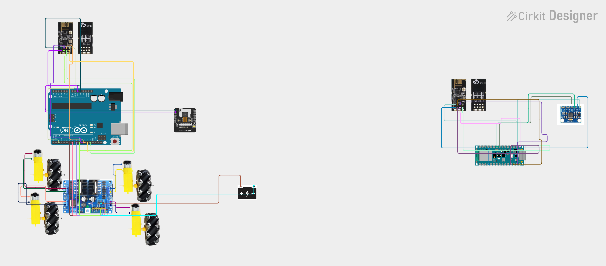

# Gesture Controlled robot
Gesture‑Controlled Car is a wireless robotic vehicle that responds to hand movements instead of traditional joysticks or remotes. Using an IMU‑equipped controller, the system translates tilt, rotation, and directional gestures into real‑time steering and throttle commands. The receiver onboard the car interprets these commands and drives the motors.

This project explores embedded communication, sensor fusion, and wireless control systems while building a functional, intuitive interface for robotics. It also includes an FPV ESP32‑CAM for live video streaming.


| **Engineer** | **School** | **Area of Interest** | **Grade** |
|:--:|:--:|:--:|:--:|
| Asher M | Yeshivat Frisch | Computer Science | Incoming Junior

**Replace the BlueStamp logo below with an image of yourself and your completed project. Follow the guide [here](https://tomcam.github.io/least-github-pages/adding-images-github-pages-site.html) if you need help.**


  
# Final Milestone

**Don't forget to replace the text below with the embedding for your milestone video. Go to Youtube, click Share -> Embed, and copy and paste the code to replace what's below.**


For your final milestone, explain the outcome of your project. Key details to include are:
- What you've accomplished since your previous milestone
- What your biggest challenges and triumphs were at BSE
- A summary of key topics you learned about
- What you hope to learn in the future after everything you've learned at BSE


# Second Milestone

**Don't forget to replace the text below with the embedding for your milestone video. Go to Youtube, click Share -> Embed, and copy and paste the code to replace what's below.**

<iframe width="560" height="315" src="https://www.youtube.com/embed/GfkQ12mFPzY?si=WwiRgI6MAY1NraKs&amp;start=204" title="YouTube video player" frameborder="0" allow="accelerometer; autoplay; clipboard-write; encrypted-media; gyroscope; picture-in-picture; web-share" referrerpolicy="strict-origin-when-cross-origin" allowfullscreen></iframe>

For your second milestone, explain what you've worked on since your previous milestone. You can highlight:
- Technical details of what you've accomplished and how they contribute to the final goal
- What has been surprising about the project so far
- Previous challenges you faced that you overcame
- What needs to be completed before your final milestone 

# First Milestone

**Don't forget to replace the text below with the embedding for your milestone video. Go to Youtube, click Share -> Embed, and copy and paste the code to replace what's below.**

<iframe width="560" height="315" src="https://www.youtube.com/embed/jKzRvB4pZn8?si=eezAk86leaGEL-HH" title="YouTube video player" frameborder="0" allow="accelerometer; autoplay; clipboard-write; encrypted-media; gyroscope; picture-in-picture; web-share" referrerpolicy="strict-origin-when-cross-origin" allowfullscreen></iframe>

Components & How They Integrate
- **Arduino Uno** – main controller that sends direction and speed signals.
- **L298N Motor Driver** – receives signals from the Arduino and controls all four DC motors.
- **DC Motors (x4)** – provide movement; wired to OUT1–OUT4 on the driver.
- **9V battries** – powers everything.
- **Bluetooth Module (HC‑05)** – will receive gesture commands from the glove.

---

Technical Progress So Far
- Fully assembled and wired the robot chassis and mounted all motors.

---

Challenges
- Unclear Car schematics, I worked around it by discarding the instrcutions entirly and using logical deduction to to connect the parts of the chasis.
- HC05 pairing issues, I initally was able to work around it using my project [Subspace Relay](https://github.com/asherm613/Subspace-Relay) but the modules then died so I decided to switch to a much simpler transciver system, RF24

---

Future Plans
- Build the gesture‑control glove using the Nano, IMU, and RF24.
- Convert hand tilt into direction and speed values.
- Send those values over Bluetooth to the car.
- Integrate glove → car communication and refine responsiveness.


# Schematics 


# Code
Here's where you'll put your code. The syntax below places it into a block of code. Follow the guide [here]([url](https://www.markdownguide.org/extended-syntax/)) to learn how to customize it to your project needs. 

```c++
void setup() {
  // put your setup code here, to run once:
  Serial.begin(9600);
  Serial.println("Hello World!");
}

void loop() {
  // put your main code here, to run repeatedly:

}
```

# Bill of Materials

| **Part** | **Note** | **Price** | **Link** |
|:--:|:--:|:--:|:--:|
| Car Chassis Kit | Base frame for car | $39.99 | <a href="https://www.amazon.com/dp/B0DJ7BT1V5">Link</a> |
| Screwdriver Kit | Assembly tools | $5.94 | <a href="https://www.amazon.com/Small-Screwdriver-Set-Mini-Magnetic/dp/B08RYXKJW9/">Link</a> |
| Arduino Uno | Main controller | $14.98 | <a href="https://www.amazon.com/ELEGOO-Board-ATmega328P-ATMEGA16U2-Compliant/dp/B01EWOE0UU/">Link</a> |
| Electronics Kit | Components & sensors | $14.00 | <a href="https://www.amazon.com/Smraza-Electronics-Potentiometer-tie-Points-Breadboard/dp/B0B62RL725/">Link</a> |
| Breadboard Kit | Prototyping circuits | $8.79 | <a href="https://www.amazon.com/Breadboards-Solderless-Breadboard-Distribution-Connecting/dp/B07DL13RZH/">Link</a> |
| Arduino Nano 33 BLE Sense | Gesture controller | $39.70 | <a href="https://www.amazon.com/Arduino-Nano-Sense-headers-ABX00070/dp/B0BQHZ88WD/">Link</a> |
| Micro USB Cable | Power/data for Nano | $5.00 | <a href="https://www.amazon.com/Charging-Transfer-Android-Trustable-MYFON/dp/B098DW7485/">Link</a> |
| Accelerometer | Motion sensing | $9.00 | <a href="https://www.amazon.com/dp/B0D2TJVMNY">Link</a> |
| RF24 | Wireless transmission | $14.99 | <a href="https://www.amazon.com/Aideepen-NRF24L01-Transceiver-Breakout-Compatible/dp/B07ZGQ2X7Q/ref=sr_1_1_sspa?crid=99G5OJXI92OD&dib=eyJ2IjoiMSJ9.SfPdL9U9Z29-1y-O21koQy_1az5Xh4TTqomMlO854jOSvGYrWDY_x2lIffUv6gAxi21pobaw2AsUX0eyM2MZVsxhTSYY20phkY-E8gd6J6epmfVsWVOGNGU3E-01-GgkUHJyKek6mZpBmLh5sQczLOT_qodXG935PEZocmXfN2XuNNRfqU2oxKlikjh-udQdoY_D90zkKfsDhRCZpy_5F8JzNUcwuWANoGU0AjI0vqg.RTNUwoWUKnYQ6fNMkYemUPdpm-h2pQE0yODHnypquuE&dib_tag=se&keywords=nrf24&qid=1783697464&sprefix=nrf24%2Caps%2C147&sr=8-1-spons&sp_csd=d2lkZ2V0TmFtZT1zcF9hdGY&th=1">Link</a> |
| Breadboard Power Supply | 3.3V/5V power | $8.00 | <a href="https://www.amazon.com/ALAMSCN-Solderless-Breadboard-Battery-Arduino/dp/B08JYPMCZY/">Link</a> |
| 9V Batteries | Power | $8.69 | <a href="https://www.amazon.com/Amazon-Basics-Performance-All-Purpose-Batteries/dp/B00MH4QM1S/">Link</a> |
| Velcro Tape | Mounting components | $8.00 | <a href="https://www.amazon.com/Art3d-Sticky-Double-Sided-Command-Adhesive/dp/B0B58FGF8H/">Link</a> |
| Digital Multimeter (DMM) | Testing circuits | $9.99 | <a href="https://www.amazon.com/dp/B0CXM242J1">Link</a> |
| ESP32 CAM WiFi | FPV Camera | $9.99 | <a href="https://www.amazon.com/Hosyond-ESP32-CAM-Bluetooth-Development-Compatible/dp/B09TB1GJ7P?source=ps-sl-shoppingads-lpcontext&ref_=bing_fplfs&utm_source=copilot.com&th=1">Link</a> |

# Other Resources/Examples
- [Example 1](https://www.hackster.io/embeddedlab786/hand-gesture-control-robot-via-bluetooth-94b13d)
- [Example 2]()
- [Example 3]()
